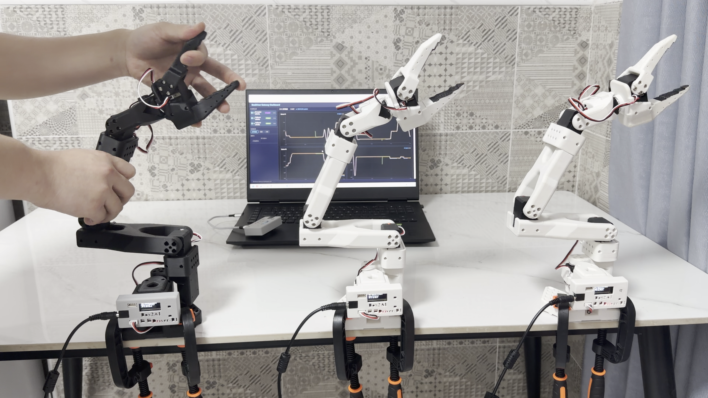
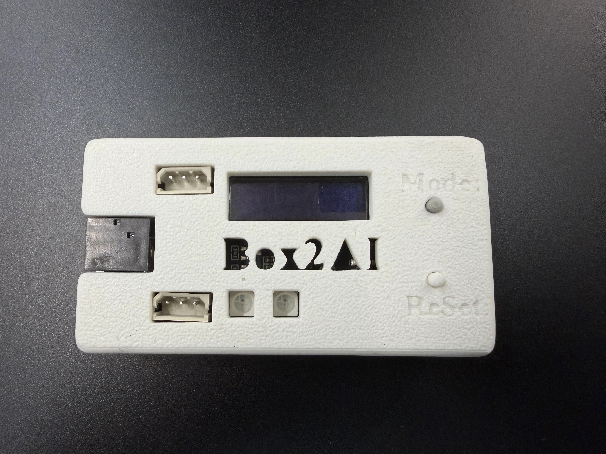
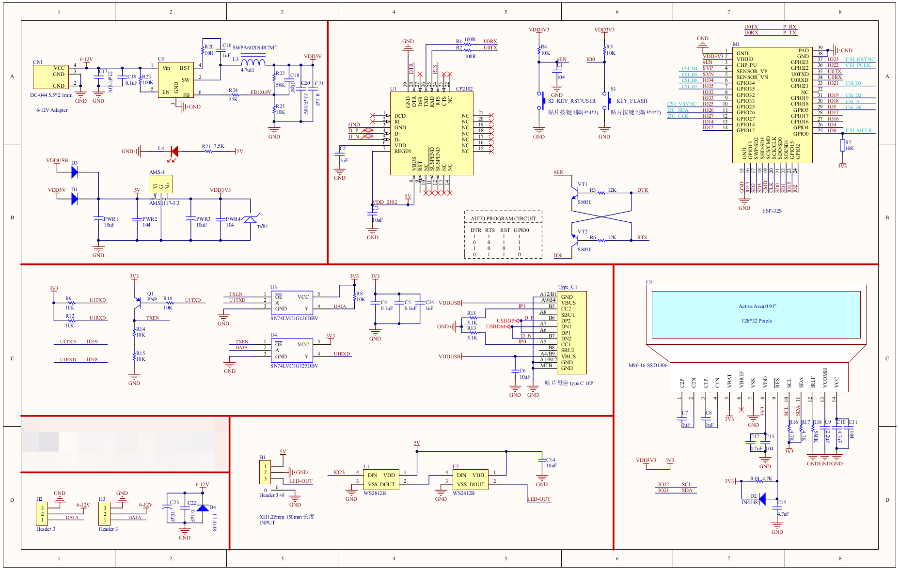
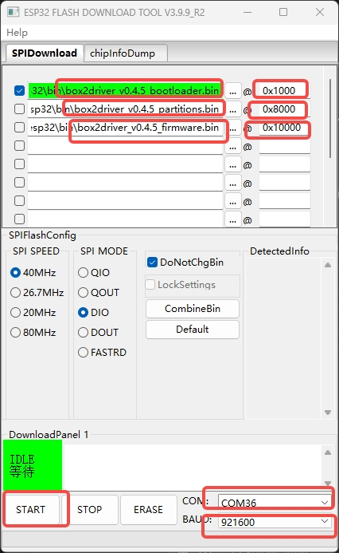
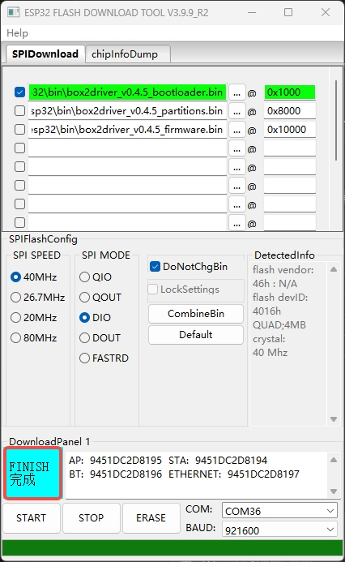
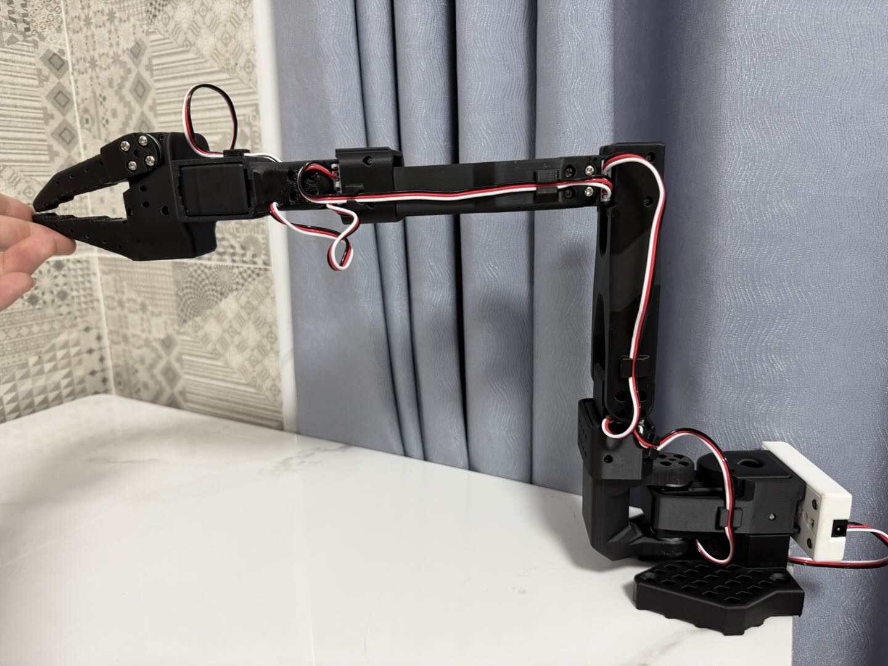

> **This project is no longer maintained. For a new project compatible with WIFI, please visit: [box2robot](https://github.com/box2ai-robotics/box2robot)**

English | [中文](README_zh.md)

# LeRobot-ESP32: Fully Wireless LeRobot Arm Control



**Cut the cables. Set your LeRobot free.**

LeRobot-ESP32 uses ESP-NOW wireless protocol to deliver fully wireless teleoperation, data collection, and AI deployment for LeRobot robot arms. No cables between Leader and Follower — just 30Hz sync with <5ms latency, plus a complete PC toolchain from data collection to model deployment.

## Why Go Wireless?

- Cables clutter your desk and limit arm placement
- Wired connections suffer from disconnections caused by cable tugging
- Stock LeRobot requires one USB cable per arm to the PC — poor scalability
- **With wireless**: Leader and Follower are independently powered, placed anywhere, auto-connect on boot

## System Architecture

```
┌─────────┐   ESP-NOW 30Hz   ┌──────────┐
│ Leader  │ ──────────────→  │ Follower │
│(read pos)│ ←────────────── │(write srv)│
└─────────┘   feedback        └──────────┘
                                   ↑
┌─────────┐   ESP-NOW            │
│ Gateway │ ←────────────────────┘
│(USB→PC) │ ──→ Serial JSON ──→ PC
└─────────┘
     ↓
┌─────────────────────────────────────┐
│ PC Toolchain                         │
│ - Web Dashboard (monitor & control)  │
│ - Virtual serial bridge (FD direct)  │
│ - LeRobot data collection & deploy   │
│ - Python API / Keyboard / JoyCon     │
└─────────────────────────────────────┘
```

## Key Features

- **ESP-NOW Wireless Sync** — Leader→Follower 30Hz real-time position sync, no USB cables
- **Virtual Servo Serial Bridge** — Map ESP32 devices to virtual COM ports, use with FD software directly
- **Gateway Dashboard** — Browser-based real-time monitoring, control, and waveform display
- **LeRobot Integration** — Wireless dataset collection + model inference deployment
- **Python Client API** — Data reading, control, recording & playback
- **Keyboard IK Control** — Cartesian / joint-space keyboard teleoperation
- **JoyCon IK Bridge** — Joy-Con controller pose → IK → robot arm
- **Pre-built Firmware** — Flash and go, no build environment needed

## Hardware

<div align="center">
  <a href="https://item.taobao.com/item.htm?abbucket=5&id=1030962099420">
    
  </a>
  <br>
  <a href="https://item.taobao.com/item.htm?abbucket=5&id=1030962099420">Purchase the Box2AI controller board (Taobao)</a>
</div>

**Schematic:**



### Servo Cable Wiring — Feetech vs Hiwonder

Box2Driver v0.4.5+ supports both **Feetech (飞特)** and **Hiwonder (幻尔)** bus servos. The firmware auto-detects the servo type on boot, but **the two brands use different cable connector orientations** — please identify your servo brand and prepare the correct cables before wiring.


| Brand | Connector orientation | Description |
|-------|----------------------|-------------|
| **Hiwonder (幻尔)** | Same direction (同向) | Both connectors face the same way |
| **Feetech (飞特)** | Reversed (反向) | Connectors face opposite directions |

> **Warning:** Using the wrong cable orientation may cause reversed pin order (signal/power/GND swap), which can damage your servos or controller board. Always verify the cable matches your servo brand before connecting.

## Quick Start

### 1. Install

```bash
git clone https://github.com/box2ai-robotics/lerobot-esp32
cd lerobot-esp32

conda create -n box2driver python=3.12 -y
conda activate box2driver
python -m pip install dist_pkg/box2driver-0.4.5-py3-none-any.whl
```

### 2. Launch

Connect a Gateway-mode ESP32 to your PC via USB. First, find the serial port assigned to the device:

| Platform | Command | Example Output |
|----------|---------|----------------|
| **Windows** (PowerShell) | `Get-CimInstance Win32_SerialPort \| Select Name, DeviceID` | `COM5` |
| **Windows** (CMD) | `mode` | `COM5` |
| **macOS** | `ls /dev/cu.usb*` | `/dev/cu.usbserial-0001` |
| **Ubuntu / Linux** | `ls /dev/ttyUSB* /dev/ttyACM*` | `/dev/ttyUSB0` |

> **Tip:** On Linux/macOS, you can also run `dmesg | tail` right after plugging in the device to see the assigned port. On Windows, check **Device Manager → Ports (COM & LPT)**.

```bash
box2driver                     # Auto-detect serial port, start Web + STS + virtual COM bridge
box2driver -p COM5             # Specify serial port
box2driver --no-bridge         # Disable com0com/socat virtual COM bridge
box2driver --no-web            # No web UI, virtual serial only
box2driver --list              # List available serial ports
```

After launch, the system automatically:
1. Detects platform and virtual serial driver (Windows: com0com / Linux: socat / macOS: socat)
2. Connects to Gateway WebSocket
3. Discovers all ESP32 devices (Follower, Leader, etc.)
4. Creates an independent virtual serial port for each device
5. Prints the port mapping table

```
  Device      | MAC             | Port (Windows)  | Port (Linux/macOS)
  ------------|-----------------|-----------------|-----------------------------
  Leader      | ...2C:3E:28     | COM51           | socket://localhost:6560
  Follower    | ...6D:53:E0     | COM53           | socket://localhost:6561
```

Each device gets both a TCP port (`socket://localhost:<port>`) and a virtual COM port (if com0com/socat is available). COM ports require the virtual serial driver below; TCP ports always work.

**Windows**: Open FD software → select COM port (e.g. COM53) → baud rate 1000000 → scan servos
**Linux/macOS**: Use `PortHandler('socket://localhost:6561')` or `PortHandler('/dev/ttyACM0')` with `scservo_sdk`

Virtual serial driver prerequisites (required for COM port mapping):

| Platform | Installation |
|----------|-------------|
| Windows | Install [com0com](https://sourceforge.net/projects/com0com/), run as admin: `setupc install PortName=COM50 PortName=COM51` |
| Ubuntu | `sudo apt install -y socat` |
| macOS | `brew install socat` |

### 3. Python API

```python
from box2driver_client import Box2DriverClient

# Snapshot mode
client = Box2DriverClient()
client.start()
positions = client.get_all_positions()
client.send_positions([{"id": 1, "pos": 2048}])
client.stop()

# Streaming mode
for dev_id, frame in client.stream():
    print(dev_id, frame['servos'])
```

## Update Firmware

Pre-built firmware binaries are in the `bin/` directory. Devices ship with firmware pre-flashed.

Connect the ESP32 to your PC via USB, then find the serial port:

| Platform | Command | Example Output |
|----------|---------|----------------|
| **Windows** (PowerShell) | `Get-CimInstance Win32_SerialPort \| Select Name, DeviceID` | `COM5` |
| **Windows** (CMD) | `mode` | `COM5` |
| **macOS** | `ls /dev/cu.usb*` | `/dev/cu.usbserial-0001` |
| **Ubuntu / Linux** | `ls /dev/ttyUSB* /dev/ttyACM*` | `/dev/ttyUSB0` |

Replace `COM5` in the commands below with your actual port.

**Flash firmware**

All 3 files are required (bootloader + partition table + firmware):

| File | Address | Description |
|------|---------|-------------|
| box2driver_v0.4.5_bootloader.bin | 0x1000 | Bootloader |
| box2driver_v0.4.5_partitions.bin | 0x8000 | Partition table |
| box2driver_v0.4.5_firmware.bin | 0x10000 | Application firmware |

```bash
pip install esptool
python -m esptool --chip esp32 --port COM36 erase_flash
python -m esptool --chip esp32 --port COM36 --baud 921600 write_flash 0x1000 bin/box2driver_v0.4.5_bootloader.bin 0x8000 bin/box2driver_v0.4.5_partitions.bin 0x10000 bin/box2driver_v0.4.5_firmware.bin
```

> Note: `erase_flash` clears NVS storage (saved mode, bindings, etc.). You will need to reconfigure the device mode after flashing.

**Windows GUI: Flash Download Tool**

If you prefer a graphical tool, use `bin/flash_download_tool/flash_download_tool_3.9.9_R2.exe`.

> **Driver required:** If your PC does not recognize the ESP32's USB port, install the CP210x driver from `bin/flash_download_tool/CP210x_USB_TO_UART/`. Choose the version matching your Windows (Win10 / Win7-8 64-bit / XP-Win7 32-bit), run the installer, then reconnect the ESP32.

1. Open the tool, select **ChipType: ESP32**, **WorkMode: Develop**, **LoadMode: UART**, click OK:

   

2. Add the 3 bin files with their addresses, select your COM port and baud rate 921600, then click **START**:

   

3. Wait until the status shows **FINISH**:

   

## Feature Details

### Gateway Dashboard

Web-based visualization panel:
- Multi-arm real-time waveform charts
- JoyCon 6DOF pose display
- Device list and status monitoring
- Control panel (torque toggle, position commands)
- Trajectory recording and playback

```bash
box2driver -p COM5 --port 8080
```

### Keyboard Control (IK / Joint Space)

```bash
python examples/keyboard_ik_control.py               # IK mode
python examples/keyboard_ik_control.py --mode joint   # Joint mode
python examples/keyboard_ik_control.py --mac AA:BB:CC:DD:EE:FF  # Specify target
```

**IK mode key bindings:**

| Key | Function | Key | Function |
|-----|----------|-----|----------|
| W/S | X forward/backward | Q/E | Roll +/- |
| A/D | Y left/right | G/T | Pitch +/- |
| R/F | Z up/down | Z/C | Gripper open/close |
| 0 | Home position | ESC | Quit |

**Joint mode key bindings:**

| Key | Function | Key | Function |
|-----|----------|-----|----------|
| 1/Q | Joint 1 base +/- | 4/R | Joint 4 wrist pitch +/- |
| 2/W | Joint 2 shoulder +/- | 5/T | Joint 5 wrist roll +/- |
| 3/E | Joint 3 elbow +/- | 6/Y | Joint 6 gripper +/- |

IK mode additional dependencies:
```bash
pip install pynput
git clone https://github.com/box-robotics/lerobot-kinematics.git
cd lerobot-kinematics && pip install -e .
```

### Record & Replay

```bash
python examples/record_replay.py
```

### LeRobot Integration

Full LeRobot AI pipeline: teleoperation data collection → policy training → inference deployment.

```bash
# Install LeRobot
pip install -r requirements.txt
git clone https://github.com/huggingface/lerobot.git
cd lerobot && pip install -e .

# Data collection example
python scripts/example_collect.py
```

## 5 Device Modes

Switch by long-pressing the BOOT button. Last selection is saved in NVS:

| Mode | Servos | Function |
|------|--------|----------|
| Follower | Read/Write | Receive sync → write servos → feedback |
| Leader | Read-only | Read positions → sync → feedback |
| M-Leader | Read-only | Same as Leader but broadcast to multiple Followers |
| Gateway | None | ESP-NOW ↔ Serial JSON bridge |
| JoyCon | None | Bluetooth controller → IK → sync |

## LED Indicators

Two onboard WS2812 RGB LEDs (GPIO23). Left LED (LED0) shows **current mode**, right LED (LED1) shows **current status**.

**LED0 — Mode (solid):**

| Mode | Color |
|------|-------|
| Follower | Green |
| Leader | Blue |
| M-Leader | Dark blue |
| Gateway | Purple |
| JoyCon | Gray |

**LED1 — Status:**

| Status | Color | Pattern | Trigger |
|--------|-------|---------|---------|
| Searching / Disconnected | Orange | Blinking | Scanning servos, Leader disconnected |
| Waiting | Blue | Solid | Idle, waiting for connection |
| Pending confirmation | Dark blue | Blinking | Received Leader handshake, awaiting button press |
| Connected | Green | Solid | Bound and syncing |
| Taken over | Purple | Solid | Controlled by Gateway/PC |
| Overloaded | Red | Both LEDs blinking | Torque protection triggered |

> Design principle: Red = fault, Green = normal, Blue = waiting, Purple = external control.

## Directory Structure

```
lerobot-esp32/
├── assets/                              # Images
│   ├── capture.png                      # Demo photo
│   ├── half_encode.jpg                  # Half-position calibration pose
│   ├── Hiwonder-feetech.png            # Servo cable orientation comparison
│   ├── hardware.jpg                     # Hardware photo
│   └── hardware_SchDoc.png             # Schematic
├── bin/                                 # Pre-built firmware (v0.4.5)
│   ├── box2driver_v0.4.5_firmware.bin
│   ├── box2driver_v0.4.5_bootloader.bin
│   ├── box2driver_v0.4.5_partitions.bin
│   └── flash_download_tool/             # Espressif Flash Download Tool
├── dist_pkg/                            # Pre-built Python package
│   └── box2driver-0.4.5-py3-none-any.whl
├── scripts/                             # Utility scripts
│   ├── check_env.py                     # Environment checker
│   ├── check_firmware.py                # Firmware version checker
│   ├── example_collect.py               # Data collection example
│   ├── compare_servo_protocol.py        # STS protocol debug tool
│   ├── set_motors_half_encode.py        # Motor encoder offset calibration
│   ├── start_servo_bridge.bat           # Windows virtual serial launcher
│   └── start_servo_bridge.sh            # Linux/macOS virtual serial launcher
├── examples/                            # Example scripts
│   ├── keyboard_ik_control.py           # Keyboard IK / joint-space control
│   ├── record_replay.py                 # Record & replay trajectories
│   ├── so100_kinematics.py              # SO-100 kinematics example
│   └── docs/
│       └── virtual_com_setup.md         # Virtual COM setup guide
├── requirements.txt                     # Dependencies
└── VERSION
```

## FAQ

### Leader and Follower arms don't match in position/pose

This is caused by inconsistent encoder values due to different motor installation positions. You can fix this by writing encoder offsets using the calibration script.

**Steps:**

1. Physically align all servo motors of the arm to the half-position pose (each joint at mechanical center). Refer to the image below:

   

2. Connect **one arm at a time** to the PC using a **USB-to-TTL adapter board** (not via the Box2Driver controller), then run:

   ```bash
   pip install ftservo-python-sdk pyserial
   python scripts/set_motors_half_encode.py -p COM5          # Auto-detect servo type
   python scripts/set_motors_half_encode.py -p COM5 -t feetech   # Force Feetech
   python scripts/set_motors_half_encode.py -p COM5 -t hiwonder  # Force Hiwonder
   python scripts/set_motors_half_encode.py -p COM5 --max-id 8   # Scan ID 1~8
   ```

3. The script will:
   - Auto-detect servo type (Feetech or Hiwonder) if not specified
   - Scan and find all connected motors automatically
   - Clear all existing encoder offsets
   - Read the current position of each motor
   - Calculate and write the offset so that the current position maps to center value (Feetech: 2048, Hiwonder: 500)
   - Continuously print positions for verification (Ctrl+C to exit)

4. Run this script on **both** Leader and Follower arms to ensure they share the same encoder reference.

## Changelog

| Version | Date | Notes |
|---------|------|-------|
| v0.4.5 | 2026-03-23 | Hiwonder LX series bus servo support, auto-detect servo type (Feetech/Hiwonder) on boot, 115200 baud single-command mode |
| v0.4.4 | 2026-03-19 | Dual RGB LED system (mode+status), RMT channel conflict fix, mode-switch torque race fix, integrated STS TCP virtual serial |
| v0.4.3 | 2026-03-18 | Full STS protocol for virtual COM bridge, Gateway control stability, WS disconnect protection |
| v0.4.2 | 2026-03-18 | Virtual servo serial bridge (cross-platform), multi-device auto-detection, com0com/socat support |
| v0.4.1 | 2026-03-17 | 30Hz parameter tuning, quick-start section, keyboard IK control example |

If this project helps you, please give it a star!

## License

Apache 2.0 License

## Links

- [LeRobot](https://github.com/huggingface/lerobot)
- [lerobot-kinematics](https://github.com/box-robotics/lerobot-kinematics)
